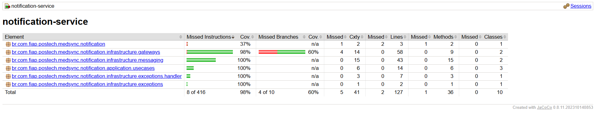

# 🏥 MedSync Healthcare System - **Tech Challenge 3ª Fase**

## 📑 ÍNDICE

* [Descrição do Projeto](#descrição-do-projeto)
* [Funcionalidades e Endpoints](#funcionalidades-e-endpoints)
   * [📅 Scheduling Service](#-scheduling-service)
   * [📨 Notification Service](#-notification-service)
   * [📖 History Service (GraphQL)](#-history-service-graphql)
* [Tecnologias Utilizadas](#tecnologias-utilizadas)
* [Estrutura do Projeto](#estrutura-do-projeto)
* [Clean Architecture](#clean-architecture)
* [Diagrama de Arquitetura](#diagrama-de-arquitetura)
* [Diagrama das tabelas de banco de dados](#diagrama-das-tabelas-de-banco-de-dados)
* [Requisitos](#requisitos)
* [Como Rodar o Projeto](#como-rodar-o-projeto)
* [Documentação da API](#documentação-da-api)
* [Cobertura de código](#cobertura-de-código)
* [Collection POSTMAN](#collection-postman)
* [Environment POSTMAN](#environment-postman)

---

## 📌 Descrição do Projeto

O **MedSync Healthcare System** é uma API modular e containerizada que oferece:

* Agendamento de consultas médicas.
* Envio de notificações automáticas a pacientes.
* Exposição do histórico clínico via **GraphQL**.
* Comunicação assíncrona entre serviços via **RabbitMQ**.

O sistema contempla perfis distintos (**DOCTOR, NURSE, PATIENT**) com permissões específicas conforme os requisitos do desafio.

---

## ⚙️ Funcionalidades e Endpoints

### 📅 Scheduling Service

| Operação                 | Descrição                           | Acesso       |
| ------------------------ | ----------------------------------- |--------------|
| `POST /appointments`     | Criar nova consulta                 | DOCTOR/NURSE |
| `PUT /appointments/{id}` | Editar uma consulta existente       | DOCTOR/NURSE |
| `GET /appointments/{id}` | Visualizar detalhes de uma consulta | DOCTOR/NURSE |
| `GET /appointments`      | Listar consultas (com filtros)      | DOCTOR/NURSE |

---

### 📨 Notification Service

| Operação                    | Descrição                                    | Acesso  |
| --------------------------- | -------------------------------------------- | ------- |
| Recebe eventos via RabbitMQ | Processa mensagens de agendamento/editadas   | Interno |

---

### 📖 History Service (GraphQL)

| Operação (GraphQL)          | Descrição                               | Acesso  |
| --------------------------- | --------------------------------------- | ------- |
| `patientHistory(patientId)` | Retorna histórico completo do paciente  | PATIENT |
| `appointments(patientId)`   | Retorna consultas agendadas ou passadas | PATIENT |

# 🔄 Fluxo de Mensagens RabbitMQ

| Evento | Routing Key | Queue Destino | Ação no History Service |
|--------|-------------|---------------|------------------------|
| **APPOINTMENT_CREATED** | `appointment.created` | `history.service.queue` | Cria registro básico da consulta |
| **APPOINTMENT_COMPLETED** | `appointment.completed` | `history.service.queue` | Atualiza status para "COMPLETED" |
| **MEDICAL_DATA_ADDED** | `appointment.medical.updated` | `history.service.queue` | Adiciona diagnósticos e prescrições |
| **APPOINTMENT_CANCELLED** | `appointment.cancelled` | `history.service.queue` | Atualiza status para "CANCELLED" |
| **APPOINTMENT_UPDATED** | `appointment.updated` | `history.service.queue` | Atualiza data/hora da consulta |

# 🛡️ Regras de Segurança

| Validação | Descrição | Implementação |
|-----------|-----------|---------------|
| **Autenticação JWT** | Token válido obrigatório em todas as requisições | Spring Security OAuth2 |
| **Validação de Role** | Apenas usuários com role `PATIENT` podem acessar | `@PreAuthorize("hasRole('PATIENT')")` |
| **Propriedade dos Dados** | Paciente só pode acessar seu próprio histórico | Validação de `patientId` vs ID do token |
| **Idempotência** | Mensagens duplicadas não criam registros duplicados | Verificação de `appointment_id` existente |

---

## 🛠️ Tecnologias Utilizadas


---

## 📂 Estrutura do Projeto

```
medsync-healthcare-system/
├── scheduling-service/     # Microsserviço de agendamento (Java + Spring Boot)
├── notification-service/   # Microsserviço de notificações (Java + Spring Boot)
├── history-service/        # Microsserviço de histórico (GraphQL + Java)
├── docker-compose.yml      # Orquestração dos serviços
├── start.sh                # Script de inicialização
├── db/01-init.sql          # Script de criação do banco
└── collection/             # Collections e environments do Postman
```

### 🧹 Clean Architecture
Cada microsserviço segue os princípios da Clean Architecture, garantindo separação de concerns e testabilidade.


#### scheduling-service
```
scheduling-service/
├── src/
│   ├── main/
│   │   ├── java/
│   │   │   └── br/com/fiap/postech/medsync/scheduling/
│   │   │       │
│   │   │       ├── application/
│   │   │       │   ├── controllers/
│   │   │       │   │   └── AppointmentController.java
│   │   │       │   ├── dtos/
│   │   │       │   │   ├── requests/
│   │   │       │   │   │   ├── CreateAppointmentRequest.java
│   │   │       │   │   │   └── UpdateAppointmentRequest.java
│   │   │       │   │   └── responses/
│   │   │       │   │       └── AppointmentResponse.java
│   │   │       │   └── gateways/
│   │   │       │       └── NotificationGateway.java
│   │   │       │
│   │   │       ├── domain/
│   │   │       │   ├── entities/
│   │   │       │   │   └── Appointment.java
│   │   │       │   ├── gateways/
│   │   │       │   │   └── AppointmentRepositoryGateway.java
│   │   │       │   └── usecases/
│   │   │       │       ├── CreateAppointmentUseCase.java
│   │   │       │       ├── UpdateAppointmentUseCase.java
│   │   │       │       └── CancelAppointmentUseCase.java
│   │   │       │
│   │   │       └── infrastructure/
│   │   │           ├── config/
│   │   │           │   ├── dependency/
│   │   │           │   ├── security/
│   │   │           │   └── RabbitMQConfig.java
│   │   │           ├── exceptions/
│   │   │           │   └── handler/
│   │   │           ├── persistence/
│   │   │           │   ├── entity/
│   │   │           │   │   └── AppointmentJpaEntity.java
│   │   │           │   └── repository/
│   │   │           │       └── AppointmentRepository.java
│   │   │           └── messaging/
│   │   │               └── RabbitMQNotificationGateway.java
│   │   │
│   │   └── resources/
│   │       ├── application.properties
│   │       └── db/migration/
│   │
│   └── test/
│       ├── java/... (estrutura espelhada)
│       └── resources/
├── Dockerfile
└── pom.xml
```

#### notification-service
```
notification-service/
├── src/
│   ├── main/
│   │   ├── java/
│   │   │   └── br/com/fiap/postech/medsync/notification/
│   │   │       ├── application/
│   │   │       │   └── usecases/
│   │   │       │       ├── CreateNotificationUseCase.java    	 # Interfaces
│   │   │       │       ├── CreateNotificationUseCaseImp.java
│   │   │       │       ├── SendNotificationUseCase.java      	 # Interfaces
│   │   │       │       ├── SendNotificationUseCaseImp.java
│   │   │       │       ├── UpdateNotificationStatusUseCase.java # Interfaces
│   │   │       │       └── UpdateNotificationStatusUseCaseImp.java
│   │   │       │
│   │   │       ├── domain/
│   │   │       │   └── entities/
│   │   │       │   │   ├── Notification.java
│   │   │       │   │   └── NotificationStatus.java
│   │   │       │   └── gateways/
│   │   │       │       ├── NotificationGateway.java			 # Interfaces
│   │   │       │       └── EmailNotificationGateway.java		 # Interfaces
│   │   │       │
│   │   │       └── infrastructure/
│   │   │           ├── config/
│   │   │           │   ├── RabbitMQConfig.java
│   │   │           │   └── EmailConfig.java
│   │   │           ├── exceptions/
│   │   │           │   └── handler/
│   │   │           │ 		└── GlobalExceptionHandler.java
│   │   │           ├── persistence/
│   │   │           │   ├── entity/
│   │   │           │   │   └── NotificationEntity.java
│   │   │           │   └── repository/
│   │   │           │       └── NotificationRepository.java
│   │   │           ├── gateways/
│   │   │           │   ├── NotificationGatewayImp.java        
│   │   │           │   └── EmailNotificationGatewayImpl.java
│   │   │           └── messaging/
│   │   │               └── NotificationMessageConsumer.java 
│   │   │
│   │   └── resources/
│   │       └── application.properties
│   │
│   └── test/
└── pom.xml
```

##### history-service (GraphQL)
```
history-service/
├── src/
│   ├── main/
│   │   ├── java/
│   │   │   └── br/com/fiap/postech/medsync/history/
│   │   │       │
│   │   │       ├── HistoryServiceApplication.java
│   │   │       │
│   │   │       ├── application/
│   │   │       │   ├── usecases/
│   │   │       │   │   │   ProcessAppointmentEventUseCase.java
│   │   │       │   │   │   ProcessAppointmentEventUseCaseImp.java
│   │   │       │   │   │   GetPatientHistoryUseCase.java
│   │   │       │   │   │   GetPatientHistoryUseCaseImp.java
│   │   │       │   │   │   GetAppointmentsByStatusUseCase.java
│   │   │       │   │   │   GetAppointmentsByStatusUseCaseImp.java
│   │   │       │   │   │   UpdateMedicalRecordUseCase.java
│   │   │       │   │   │   UpdateMedicalRecordUseCaseImp.java
│   │   │       │   │   │   CreateMedicalRecordUseCase.java
│   │   │       │   │   │   CreateMedicalRecordUseCaseImp.java
│   │   │       │   │   │
│   │   │       │   └── dtos/
│   │   │       │       │   AppointmentEventDTO.java
│   │   │       │       │   MedicalDataDTO.java
│   │   │       │       │   MedicalRecordResponseDTO.java
│   │   │       │       │   GraphQLQueryRequest.java
│   │   │       │       │
│   │   │       │       └── responses/
│   │   │       │               MedicalRecordResponse.java
│   │   │       │
│   │   │       ├── domain/
│   │   │       │   ├── entities/
│   │   │       │   │       MedicalRecord.java
│   │   │       │   │       AppointmentStatus.java
│   │   │       │   │       EventType.java
│   │   │       │   │
│   │   │       │   └── gateways/
│   │   │       │           MedicalRecordRepositoryGateway.java
│   │   │       │           AppointmentEventGateway.java
│   │   │       │
│   │   │       └── infrastructure/
│   │   │           ├── config/
│   │   │           │       RabbitMQConfig.java
│   │   │           │       GraphQLConfig.java
│   │   │           │       SecurityConfig.java
│   │   │           │       DependencyInjectionConfig.java
│   │   │           │
│   │   │           ├── exceptions/
│   │   │           │   │   MedicalRecordNotFoundException.java
│   │   │           │   │   InvalidAppointmentEventException.java
│   │   │           │   │   PatientAccessDeniedException.java
│   │   │           │   │
│   │   │           │   └── handler/
│   │   │           │           GlobalExceptionHandler.java
│   │   │           │           GraphQLExceptionHandler.java
│   │   │           │
│   │   │           ├── gateways/
│   │   │           │       MedicalRecordRepositoryGatewayImpl.java
│   │   │           │       AppointmentEventGatewayImpl.java
│   │   │           │
│   │   │           ├── messaging/
│   │   │           │       AppointmentMessageConsumer.java
│   │   │           │       AppointmentMessageDTO.java
│   │   │           │
│   │   │           ├── persistence/
│   │   │           │   ├── entity/
│   │   │           │   │       MedicalRecordJpaEntity.java
│   │   │           │   │
│   │   │           │   └── repository/
│   │   │           │           MedicalRecordRepository.java
│   │   │           │
│   │   │           └── resolvers/
│   │   │                   MedicalRecordResolver.java
│   │   │                   MedicalRecordQueryResolver.java
│   │   │
│   │   └── resources/
│   │       ├── application.properties
│   │       └── graphql/
│   │           └── medicalRecord.graphqls
│   │
│   └── test/
│       └── java/
│           └── br/com/fiap/postech/medsync/history/
│               ├── application/
│               ├── domain/
│               └── infrastructure/
├── Dockerfile
└── pom.xml
```

---

## 📡 Diagrama de Arquitetura


---

## 🗄️ Diagrama das tabelas de banco de dados


> O script [`01-init.sql`](db/01-init.sql) define schemas **scheduling** e **history**, incluindo entidades de usuários, pacientes, médicos, consultas e histórico clínico.

---

## 📋 Requisitos

* [Java 21](https://www.oracle.com/java/technologies/javase/jdk21-archive-downloads.html)
* [Maven](https://maven.apache.org/)
* [Docker](https://www.docker.com/)
* [Postman](https://www.postman.com/)

---

## ▶️ Como Rodar o Projeto

1. **Clone o repositório:**

   ```bash
   git clone https://github.com/luizffdemoraes/medsync-healthcare-system
   cd medsync-healthcare-system
   ```

2. **Execute o script de inicialização:**

   ```bash
   ./start.sh
   ```

3. **Acesse os serviços:**

   * Scheduling: [http://localhost:8080](http://localhost:8080)
   * History (GraphQL): [http://localhost:8081/graphql](http://localhost:8081/graphql)
   * Notification: [http://localhost:8082](http://localhost:8082)
   * RabbitMQ Console: [http://localhost:15672](http://localhost:15672)

---

## 📖 Documentação da API

A documentação de endpoints estará disponível via Swagger UI nos serviços REST:

* [http://localhost:8080/swagger-ui/index.html](http://localhost:8080/swagger-ui/index.html)
* [http://localhost:8082/swagger-ui/index.html](http://localhost:8082/swagger-ui/index.html)

---

## 📊 Cobertura de código

Gerada com **JaCoCo**.

```bash
mvn clean test
mvn jacoco:report
```

O relatório estará disponível em:

```
target/site/jacoco/index.html
```

### Exemplo da cobertura gerada:

### notification-service



---

## 🧪 Collection POSTMAN

Arquivo disponível em `collection/medsync-healthcare.postman_collection.json`.

## 🌍 Environment POSTMAN

Arquivo disponível em `collection/medsync-healthcare.postman_environment.json`.

---

🔒 **Perfis de Usuários**

| Role    | Permissões                                                           |
| ------- | -------------------------------------------------------------------- |
| DOCTOR  | Visualizar e editar histórico, registrar consultas.                  |
| NURSE   | Registrar consultas e acessar histórico.                             |
| PATIENT | Visualizar apenas suas consultas e receber notificações automáticas. |

---
