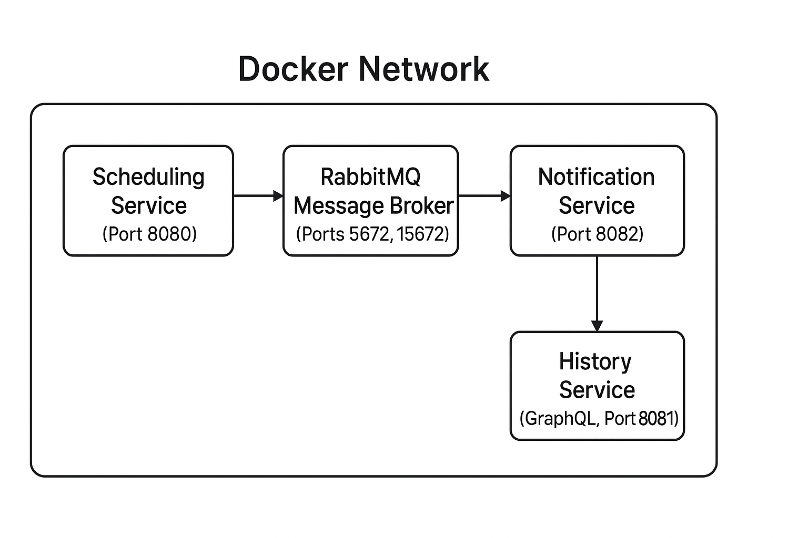
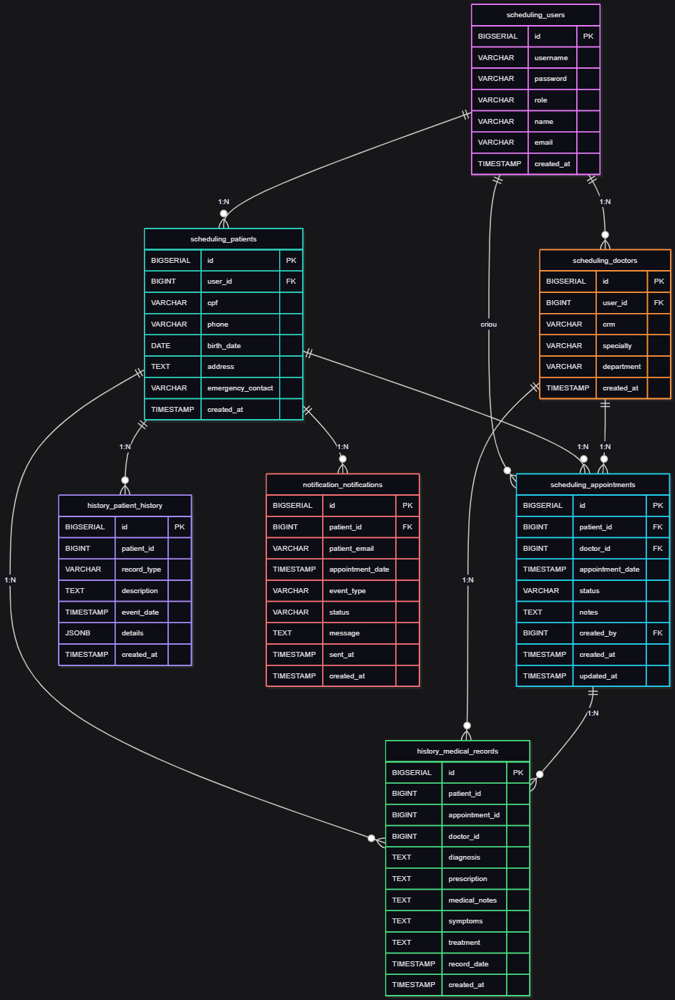

# 🏥 MedSync Healthcare System - **Tech Challenge 3ª Fase**

## 📑 ÍNDICE

* [Descrição do Projeto](#descrição-do-projeto)
* [Funcionalidades e Endpoints](#funcionalidades-e-endpoints)

   * [📅 Scheduling Service](#-scheduling-service)
   * [📨 Notification Service](#-notification-service)
   * [📖 History Service (GraphQL)](#-history-service-graphql)
* [Tecnologias Utilizadas](#tecnologias-utilizadas)
* [Estrutura do Projeto](#estrutura-do-projeto)
* [Diagrama de Arquitetura](#diagrama-de-arquitetura)
* [Diagrama das tabelas de banco de dados](#diagrama-das-tabelas-de-banco-de-dados)
* [Requisitos](#requisitos)
* [Como Rodar o Projeto](#como-rodar-o-projeto)
* [Documentação da API](#documentação-da-api)
* [Cobertura de código](#cobertura-de-código)
* [Collection POSTMAN](#collection-postman)
* [Environment POSTMAN](#environment-postman)

---

## 📌 Descrição do Projeto

O **MedSync Healthcare System** é uma API modular e containerizada que oferece:

* Agendamento de consultas médicas.
* Envio de notificações automáticas a pacientes.
* Exposição do histórico clínico via **GraphQL**.
* Comunicação assíncrona entre serviços via **RabbitMQ**.

O sistema contempla perfis distintos (**DOCTOR, NURSE, PATIENT**) com permissões específicas conforme os requisitos do desafio.

---

## ⚙️ Funcionalidades e Endpoints

### 📅 Scheduling Service

| Operação                 | Descrição                           | Acesso               |
| ------------------------ | ----------------------------------- | -------------------- |
| `POST /appointments`     | Criar nova consulta                 | DOCTOR/NURSE         |
| `PUT /appointments/{id}` | Editar uma consulta existente       | DOCTOR/NURSE         |
| `GET /appointments/{id}` | Visualizar detalhes de uma consulta | DOCTOR/NURSE/PATIENT |
| `GET /appointments`      | Listar consultas (com filtros)      | DOCTOR/NURSE/PATIENT |

---

### 📨 Notification Service

| Operação                    | Descrição                                    | Acesso  |
| --------------------------- | -------------------------------------------- | ------- |
| Recebe eventos via RabbitMQ | Processa mensagens de agendamento/editadas   | Interno |
| `GET /notifications/{id}`   | Consulta notificações enviadas a um paciente | DOCTOR  |

---

### 📖 History Service (GraphQL)

| Operação (GraphQL)          | Descrição                               | Acesso               |
| --------------------------- | --------------------------------------- | -------------------- |
| `patientHistory(patientId)` | Retorna histórico completo do paciente  | DOCTOR/NURSE/PATIENT |
| `appointments(patientId)`   | Retorna consultas agendadas ou passadas | DOCTOR/NURSE/PATIENT |

---

## 🛠️ Tecnologias Utilizadas


---

## 📂 Estrutura do Projeto

```
medsync-healthcare-system/
├── scheduling-service/     # Microsserviço de agendamento (Java + Spring Boot)
├── notification-service/   # Microsserviço de notificações (Java + Spring Boot)
├── history-service/        # Microsserviço de histórico (GraphQL + Java)
├── docker-compose.yml      # Orquestração dos serviços
├── start.sh                # Script de inicialização
├── db/01-init.sql          # Script de criação do banco
└── collection/             # Collections e environments do Postman
```

---

## 📡 Diagrama de Arquitetura



---

## 🗄️ Diagrama das tabelas de banco de dados



> O script [`01-init.sql`](db/01-init.sql) define schemas **scheduling** e **history**, incluindo entidades de usuários, pacientes, médicos, consultas e histórico clínico.

---

## 📋 Requisitos

* [Java 21](https://www.oracle.com/java/technologies/javase/jdk21-archive-downloads.html)
* [Maven](https://maven.apache.org/)
* [Docker](https://www.docker.com/)
* [Postman](https://www.postman.com/)

---

## ▶️ Como Rodar o Projeto

1. **Clone o repositório:**

   ```bash
   git clone https://github.com/luizffdemoraes/medsync-healthcare-system
   cd medsync-healthcare-system
   ```

2. **Execute o script de inicialização:**

   ```bash
   ./start.sh
   ```

3. **Acesse os serviços:**

   * Scheduling: [http://localhost:8080](http://localhost:8080)
   * History (GraphQL): [http://localhost:8081/graphql](http://localhost:8081/graphql)
   * Notification: [http://localhost:8082](http://localhost:8082)
   * RabbitMQ Console: [http://localhost:15672](http://localhost:15672)

---

## 📖 Documentação da API

A documentação de endpoints estará disponível via Swagger UI nos serviços REST:

* [http://localhost:8080/swagger-ui/index.html](http://localhost:8080/swagger-ui/index.html)
* [http://localhost:8082/swagger-ui/index.html](http://localhost:8082/swagger-ui/index.html)

---

## 📊 Cobertura de código

Gerada com **JaCoCo**.

```bash
mvn clean test
mvn jacoco:report
```

O relatório estará disponível em:

```
target/site/jacoco/index.html
```

---

## 🧪 Collection POSTMAN

Arquivo disponível em `collection/medsync-healthcare.postman_collection.json`.

## 🌍 Environment POSTMAN

Arquivo disponível em `collection/medsync-healthcare.postman_environment.json`.

---

🔒 **Perfis de Usuários**

| Role    | Permissões                                                           |
| ------- | -------------------------------------------------------------------- |
| DOCTOR  | Visualizar e editar histórico, registrar consultas.                  |
| NURSE   | Registrar consultas e acessar histórico.                             |
| PATIENT | Visualizar apenas suas consultas e receber notificações automáticas. |

---
