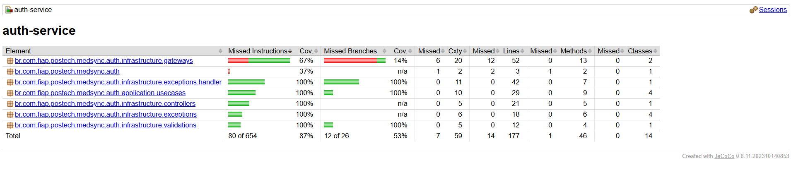
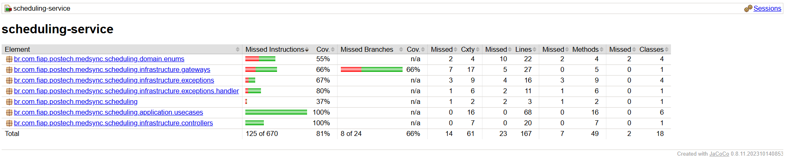
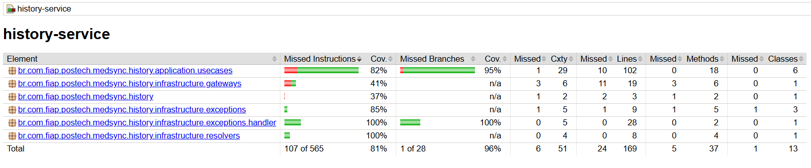

# 🏥 MedSync Healthcare System - **Tech Challenge 3ª Fase**

## 📑 ÍNDICE

* [Descrição do Projeto](#descrição-do-projeto)
* [Funcionalidades e Endpoints](#funcionalidades-e-endpoints)
   * [📅 Scheduling Service](#-scheduling-service)
   * [📨 Notification Service](#-notification-service)
   * [📖 History Service (GraphQL)](#-history-service-graphql)
* [Tecnologias Utilizadas](#tecnologias-utilizadas)
* [Estrutura do Projeto](#estrutura-do-projeto)
* [Clean Architecture](#clean-architecture)
* [Diagrama de Arquitetura](#diagrama-de-arquitetura)
* [Diagrama das tabelas de banco de dados](#diagrama-das-tabelas-de-banco-de-dados)
* [Requisitos](#requisitos)
* [Como Rodar o Projeto](#como-rodar-o-projeto)
* [Documentação da API](#documentação-da-api)
* [Cobertura de código](#cobertura-de-código)
* [Collection POSTMAN](#collection-postman)
* [Environment POSTMAN](#environment-postman)

---

## 📌 Descrição do Projeto

O **MedSync Healthcare System** é uma API modular e containerizada que oferece:
* Cadastro de pacientes, medicos, enfermeiros, geração de token e autenticação .
* Agendamento de consultas médicas.
* Envio de notificações automáticas a pacientes por emal.
* Exposição do histórico clínico via **GraphQL**.
* Comunicação assíncrona entre serviços via **RabbitMQ**.

O sistema contempla perfis distintos (**DOCTOR, NURSE, PATIENT**) com permissões específicas conforme os requisitos do desafio.

---

## ⚙️ Funcionalidades e Endpoints

### 🔐 Auth Service

| Operação                         | Descrição                               | Acesso                |
|----------------------------------|-----------------------------------------|-----------------------|
| `POST   /v1/users`               | Cria novo registro de usuário           | DOCTOR/NURSE/PATIENT  |
| `GET    /v1/users/{id}`          | Obtém detalhes de um usuário específico | DOCTOR/NURSE/PATIENT  |
| `PUT    /v1/users/{id}`          | Atualiza informações do usuário         | DOCTOR/NURSE/PATIENT  |
| `PATCH  /v1/users/{id}/password` | Altera senha do usuário                 | DOCTOR/NURSE/PATIENT  |
| `POST   /v1/oauth2/token`        | Gera token de autenticação              | DOCTOR/NURSE/PATIENT  |


### 📅 Scheduling Service

| Operação                                | Descrição                                                                                        | Acesso       |
| --------------------------------------- | ------------------------------------------------------------------------------------------------ |--------------|
| `POST /appointments`                    | Cria uma nova consulta médica                                                                    | DOCTOR/NURSE |
| `GET /appointments/{id}`                | Retorna os detalhes de uma consulta específica                                                   | DOCTOR/NURSE |
| `GET /appointments`                     | Lista consultas com filtros opcionais (`patientId`, `doctorId`, `status`)                        | DOCTOR/NURSE |
| `DELETE /appointments/{id}`             | Cancela uma consulta existente                                                                   | DOCTOR       |
| `PATCH /appointments/{id}/complete`     | Marca uma consulta como **COMPLETED**                                                            | DOCTOR       |
| `PATCH /appointments/{id}/medical-data` | Adiciona dados médicos à consulta (ex.: prescrições, observações)                                | DOCTOR       |
| `Posta mensagens em filas`              | Envia eventos para histórico e notificação (`HistoryEventProducer`, `NotificationEventProducer`) | Interno      |

---

### 📨 Notification Service

| Operação                    | Descrição                                          | Acesso  |
| --------------------------- |----------------------------------------------------| ------- |
| Recebe eventos via RabbitMQ | Processa mensagens e envia email para os pacientes | Interno |

Obs.: Requer o parametro MAILTRAP_API_TOKEN, contendo o token de acesso do Mailtrap para envio real de emails.

---

### 📖 History Service (GraphQL)


| Operação (GraphQL)                                         | Descrição                                        | Acesso               |
|------------------------------------------------------------|--------------------------------------------------|----------------------|
| `getPatientHistory(patientUserId: ID!)`                    | Retorna histórico completo do paciente           | DOCTOR/NURSE/PATIENT |
| `getAppointmentsByStatus(patientId: ID!, status: String!)` | Retorna consultas filtradas por status           | DOCTOR/NURSE/PATIENT |
| `getMedicalRecordByAppointmentId(appointmentId: ID!)`      | Retorna prontuário específico por ID da consulta | DOCTOR/NURSE/PATIENT |

**Observações:**
- `getPatientHistory` utiliza `patientUserId` como parâmetro de identificação
- `getAppointmentsByStatus` requer o `patientId` e `status` como parâmetros obrigatórios
- Todas as operações retornam tipos `MedicalRecord` ou lista deles.


# 🔄 Fluxo de Mensagens RabbitMQ

| Evento                    | Routing Key                   | Queue Destino           | Ação no History Service             |
|---------------------------|-------------------------------|-------------------------|-------------------------------------|
| **APPOINTMENT_CREATED**   | `appointment.created`         | `history.service.queue` | Cria registro básico da consulta    |
| **APPOINTMENT_COMPLETED** | `appointment.completed`       | `history.service.queue` | Atualiza status para "COMPLETED"    |
| **MEDICAL_DATA_ADDED**    | `appointment.medical.updated` | `history.service.queue` | Adiciona diagnósticos e prescrições |
| **APPOINTMENT_CANCELLED** | `appointment.cancelled`       | `history.service.queue` | Atualiza status para "CANCELLED"    |
| **APPOINTMENT_UPDATED**   | `appointment.updated`         | `history.service.queue` | Atualiza data/hora da consulta      |

# 🛡️ Regras de Segurança

| Validação                 | Descrição                                                      | Implementação                             |
|---------------------------|----------------------------------------------------------------|-------------------------------------------|
| **Autenticação JWT**      | Token válido obrigatório em todas as requisições               | Spring Security OAuth2                    |
| **Validação de Role**     | Apenas usuários com role `PATIENT` podem acessar               | `@PreAuthorize("hasRole('PATIENT')")`     |
| **Propriedade dos Dados** | Paciente só pode acessar seu próprio histórico                 | Validação de `patientId` vs ID do token   |
| **Idempotência**          | Mensagens duplicadas não criam registros duplicados            | Verificação de `appointment_id` existente |

---

## 🛠️ Tecnologias Utilizadas


---

## 📂 Estrutura do Projeto

```
medsync-healthcare-system/
├── auth-service/           # Microsserviço de autenticação (Java + Spring Boot)
├── scheduling-service/     # Microsserviço de agendamento (Java + Spring Boot)
├── notification-service/   # Microsserviço de notificações (Java + Spring Boot)
├── history-service/        # Microsserviço de histórico (GraphQL + Java)
├── docker-compose.yml      # Orquestração dos serviços
├── start.sh                # Script de inicialização
├── db/01-init.sql          # Script de criação do banco
└── collection/             # Collections e environments do Postman
```

### 🧹 Clean Architecture
Cada microsserviço segue os princípios da Clean Architecture, garantindo separação de concerns e testabilidade.

#### auth-service
```
auth-service/
├── src/
│   ├── main/
│   │   ├── java/
│   │   │   └── br/com/fiap/postech/medsync/auth/
│   │   │       │
│   │   │       ├── application/
│   │   │       │   ├── dtos/
│   │   │       │   │   ├── requests/
│   │   │       │   │   │   ├── AddressRequest.java
│   │   │       │   │   │   ├── PasswordRequest.java
│   │   │       │   │   │   └── UserRequest.java
│   │   │       │   │   │
│   │   │       │   │   └── responses/
│   │   │       │   │       ├── AddressResponse.java
│   │   │       │   │       ├── TokenResponse.java
│   │   │       │   │       └── UserResponse.java
│   │   │       │   │
│   │   │       │   └── usecases/
│   │   │       │       ├── CreateUserUseCase.java
│   │   │       │       ├── CreateUserUseCaseImp.java
│   │   │       │       ├── FindUserByIdUseCase.java
│   │   │       │       ├── FindUserByIdUseCaseImp.java
│   │   │       │       ├── UpdatePasswordUseCase.java
│   │   │       │       ├── UpdatePasswordUseCaseImp.java
│   │   │       │       ├── UpdateUserUseCase.java
│   │   │       │       └── UpdateUserUseCaseImp.java
│   │   │       │
│   │   │       ├── domain/
│   │   │       │   ├── entities/
│   │   │       │   │   ├── Address.java
│   │   │       │   │   ├── Role.java
│   │   │       │   │   └── User.java
│   │   │       │   │
│   │   │       │   ├── enums/
│   │   │       │   │   ├── RoleType.java
│   │   │       │   │   └── UserStatus.java
│   │   │       │   │
│   │   │       │   └── gateways/
│   │   │       │       ├── RoleGateway.java
│   │   │       │       └── UserGateway.java
│   │   │       │
│   │   │       └── infrastructure/
│   │   │           ├── config/
│   │   │           │   ├── dependency/
│   │   │           │   │   └── DependencyInjectionConfig.java
│   │   │           │   │
│   │   │           │   ├── mapper/
│   │   │           │   │   ├── AddressMapper.java
│   │   │           │   │   └── UserMapper.java
│   │   │           │   │
│   │   │           │   └── security/
│   │   │           │       ├── AuthorizationServerConfig.java
│   │   │           │       ├── PasswordConfig.java
│   │   │           │       ├── ResourceServerConfig.java
│   │   │           │       │
│   │   │           │       └── custom/
│   │   │           │           ├── CustomPasswordAuthenticationConverter.java
│   │   │           │           ├── CustomPasswordAuthenticationProvider.java
│   │   │           │           ├── CustomPasswordAuthenticationToken.java
│   │   │           │           └── CustomUserAuthorities.java
│   │   │           │
│   │   │           ├── controllers/
│   │   │           │   └── UserController.java
│   │   │           │
│   │   │           ├── exceptions/
│   │   │           │   ├── handler/
│   │   │           │   │   └── GlobalExceptionHandler.java
│   │   │           │   │
│   │   │           │   ├── BusinessException.java
│   │   │           │   ├── InvalidCredentialsException.java
│   │   │           │   ├── UserNotFoundException.java
│   │   │           │   └── ValidationException.java
│   │   │           │
│   │   │           ├── gateways/
│   │   │           │   ├── RoleGatewayImpl.java
│   │   │           │   └── UserGatewayImpl.java
│   │   │           │
│   │   │           ├── messaging/
│   │   │           │   └── UserEventProducer.java
│   │   │           │
│   │   │           └── persistence/
│   │   │               ├── entity/
│   │   │               │   ├── AddressEntity.java
│   │   │               │   ├── RoleEntity.java
│   │   │               │   └── UserEntity.java
│   │   │               │
│   │   │               └── repository/
│   │   │                   ├── RoleRepository.java
│   │   │                   └── UserRepository.java
│   │   │
│   │   └── resources/
│   │       ├── application.properties
│   │       ├── application-local.properties
│   │       ├── static/
│   │       └── templates/
│   │
│   └── test/
│       └── java/... (estrutura espelhada)
│
├── init-db/
│   └── 01-init.sql
│
├── Dockerfile
└── pom.xml
```

#### scheduling-service
```
scheduling-service/
├── src/
│   ├── main/
│   │   ├── java/
│   │   │   └── br/com/fiap/postech/medsync/scheduling/
│   │   │       │
│   │   │       ├── application/
│   │   │       │   ├── dtos/
│   │   │       │   │   ├── AppointmentDTO.java
│   │   │       │   │   ├── CancelAppointmentDTO.java
│   │   │       │   │   ├── CreateAppointmentDTO.java
│   │   │       │   │   ├── HistoryEventDTO.java
│   │   │       │   │   ├── NotificationMessageDTO.java
│   │   │       │   │   └── UpdateAppointmentDTO.java
│   │   │       │   │
│   │   │       │   └── usecases/
│   │   │       │       ├── AddMedicalDataUseCase.java
│   │   │       │       ├── AddMedicalDataUseCaseImp.java
│   │   │       │       ├── CancelAppointmentUseCase.java
│   │   │       │       ├── CancelAppointmentUseCaseImp.java
│   │   │       │       ├── CompleteAppointmentUseCase.java
│   │   │       │       ├── CompleteAppointmentUseCaseImp.java
│   │   │       │       ├── CreateAppointmentUseCase.java
│   │   │       │       ├── CreateAppointmentUseCaseImp.java
│   │   │       │       ├── GetAppointmentUseCase.java
│   │   │       │       ├── GetAppointmentUseCaseImp.java
│   │   │       │       ├── ListAppointmentsUseCase.java
│   │   │       │       ├── ListAppointmentsUseCaseImp.java
│   │   │       │       ├── UpdateAppointmentUseCase.java
│   │   │       │       └── UpdateAppointmentUseCaseImp.java
│   │   │       │
│   │   │       ├── domain/
│   │   │       │   ├── entities/
│   │   │       │   │   ├── Appointment.java
│   │   │       │   │   └── QueueEvent.java
│   │   │       │   │
│   │   │       │   ├── enums/
│   │   │       │   │   ├── AppointmentStatus.java
│   │   │       │   │   ├── AppointmentType.java
│   │   │       │   │   ├── EventType.java
│   │   │       │   │   └── QueueType.java
│   │   │       │   │
│   │   │       │   └── gateways/
│   │   │       │       ├── AppointmentGateway.java
│   │   │       │       └── QueueEventGateway.java
│   │   │       │
│   │   │       └── infrastructure/
│   │   │           ├── config/
│   │   │           │   ├── dependency/
│   │   │           │   │   └── DependencyInjectionConfig.java
│   │   │           │   │
│   │   │           │   ├── rabbitmq/
│   │   │           │   │   └── RabbitMQConfig.java
│   │   │           │   │
│   │   │           │   └── security/
│   │   │           │       └── SecurityConfig.java
│   │   │           │
│   │   │           ├── controllers/
│   │   │           │   └── AppointmentController.java
│   │   │           │
│   │   │           ├── exceptions/
│   │   │           │   ├── handler/
│   │   │           │   │   └── GlobalExceptionHandler.java
│   │   │           │   │
│   │   │           │   ├── AppointmentNotFoundException.java
│   │   │           │   ├── InvalidAppointmentException.java
│   │   │           │   └── SchedulingConflictException.java
│   │   │           │
│   │   │           ├── gateways/
│   │   │           │   ├── AppointmentGatewayImpl.java
│   │   │           │   └── QueueEventGatewayImpl.java
│   │   │           │
│   │   │           ├── messaging/
│   │   │           │   ├── HistoryEventProducer.java
│   │   │           │   └── NotificationEventProducer.java
│   │   │           │
│   │   │           └── persistence/
│   │   │               ├── entity/
│   │   │               │   ├── AppointmentEntity.java
│   │   │               │   └── QueueEventEntity.java
│   │   │               │
│   │   │               └── repository/
│   │   │                   ├── AppointmentRepository.java
│   │   │                   └── QueueEventRepository.java
│   │   │
│   │   └── resources/
│   │       ├── application.properties
│   │       ├── application-local.properties
│   │       ├── static/
│   │       └── templates/
│   │
│   └── test/
│       └── java/... (estrutura espelhada)
│
├── init-db/
│   └── 01-init.sql
│
├── Dockerfile
└── pom.xml
```

#### notification-service
```
notification-service/
├── src/
│   ├── main/
│   │   ├── java/
│   │   │   └── br/com/fiap/postech/medsync/notification/
│   │   │       ├── application/
│   │   │       │   └── usecases/
│   │   │       │       ├── CreateNotificationUseCase.java    	 # Interfaces
│   │   │       │       ├── CreateNotificationUseCaseImp.java
│   │   │       │       ├── SendNotificationUseCase.java      	 # Interfaces
│   │   │       │       ├── SendNotificationUseCaseImp.java
│   │   │       │       ├── UpdateNotificationStatusUseCase.java # Interfaces
│   │   │       │       └── UpdateNotificationStatusUseCaseImp.java
│   │   │       │
│   │   │       ├── domain/
│   │   │       │   └── entities/
│   │   │       │   │   ├── Notification.java
│   │   │       │   │   └── NotificationStatus.java
│   │   │       │   └── gateways/
│   │   │       │       ├── NotificationGateway.java			 # Interfaces
│   │   │       │       └── EmailNotificationGateway.java		 # Interfaces
│   │   │       │
│   │   │       └── infrastructure/
│   │   │           ├── config/
│   │   │           │   ├── RabbitMQConfig.java
│   │   │           │   └── EmailConfig.java
│   │   │           ├── exceptions/
│   │   │           │   └── handler/
│   │   │           │ 		└── GlobalExceptionHandler.java
│   │   │           ├── persistence/
│   │   │           │   ├── entity/
│   │   │           │   │   └── NotificationEntity.java
│   │   │           │   └── repository/
│   │   │           │       └── NotificationRepository.java
│   │   │           ├── gateways/
│   │   │           │   ├── NotificationGatewayImp.java        
│   │   │           │   └── EmailNotificationGatewayImpl.java
│   │   │           └── messaging/
│   │   │               └── NotificationMessageConsumer.java 
│   │   │
│   │   └── resources/
│   │       └── application.properties
│   │
│   └── test/
└── pom.xml
```

##### history-service (GraphQL)
```
history-service/
├── src/
│   ├── main/
│   │   ├── java/
│   │   │   └── br/com/fiap/postech/medsync/history/
│   │   │       │
│   │   │       ├── HistoryServiceApplication.java
│   │   │       │
│   │   │       ├── application/
│   │   │       │   ├── usecases/
│   │   │       │   │   ├── GetPatientHistoryUseCase.java
│   │   │       │   │   ├── GetPatientHistoryUseCaseImp.java
│   │   │       │   │   ├── GetAppointmentsByStatusUseCase.java
│   │   │       │   │   ├── GetAppointmentsByStatusUseCaseImp.java
│   │   │       │   │   ├── CreateMedicalRecordUseCase.java
│   │   │       │   │   ├── CreateMedicalRecordUseCaseImp.java
│   │   │       │   │   ├── AddMedicalDataUseCase.java
│   │   │       │   │   ├── AddMedicalDataUseCaseImp.java
│   │   │       │   │   ├── UpdateAppointmentStatusUseCase.java
│   │   │       │   │   └── UpdateAppointmentStatusUseCaseImp.java
│   │   │       │   │
│   │   │       │   └── dtos/
│   │   │       │       ├── requests/
│   │   │       │       │   └── GraphQLQueryRequest.java
│   │   │       │       │
│   │   │       │       ├── responses/
│   │   │       │       │   └── MedicalRecordResponse.java
│   │   │       │       │
│   │   │       │       └── messaging/
│   │   │       │           ├── AppointmentCreatedEvent.java
│   │   │       │           ├── MedicalDataAddedEvent.java
│   │   │       │           ├── AppointmentCompletedEvent.java
│   │   │       │           └── AppointmentCancelledEvent.java
│   │   │       │
│   │   │       ├── domain/
│   │   │       │   ├── entities/
│   │   │       │   │   ├── MedicalRecord.java
│   │   │       │   │   ├── AppointmentStatus.java
│   │   │       │   │   └── EventType.java
│   │   │       │   │
│   │   │       │   └── gateways/
│   │   │       │       └── MedicalRecordRepositoryGateway.java
│   │   │       │
│   │   │       └── infrastructure/
│   │   │           ├── config/
│   │   │           │   ├── RabbitMQConfig.java
│   │   │           │   ├── GraphQLConfig.java
│   │   │           │   ├── SecurityConfig.java
│   │   │           │   └── DependencyInjectionConfig.java
│   │   │           │
│   │   │           ├── exceptions/
│   │   │           │   ├── MedicalRecordNotFoundException.java
│   │   │           │   ├── InvalidAppointmentEventException.java
│   │   │           │   ├── PatientAccessDeniedException.java
│   │   │           │   │
│   │   │           │   └── handler/
│   │   │           │       ├── GlobalExceptionHandler.java
│   │   │           │       └── GraphQLExceptionHandler.java
│   │   │           │
│   │   │           ├── gateways/
│   │   │           │   └── MedicalRecordRepositoryGatewayImpl.java
│   │   │           │
│   │   │           ├── messaging/
│   │   │           │   ├── AppointmentMessageConsumer.java
│   │   │           │   └── AppointmentMessageDTO.java
│   │   │           │
│   │   │           ├── persistence/
│   │   │           │   ├── entity/
│   │   │           │   │   └── MedicalRecordJpaEntity.java
│   │   │           │   │
│   │   │           │   └── repository/
│   │   │           │       └── MedicalRecordRepository.java
│   │   │           │
│   │   │           └── resolvers/
│   │   │               ├── MedicalRecordResolver.java
│   │   │               └── MedicalRecordQueryResolver.java
│   │   │
│   │   └── resources/
│   │       ├── application.properties
│   │       └── graphql/
│   │           └── medicalRecord.graphqls
│   │
│   └── test/
│       └── java/
│           └── br/com/fiap/postech/medsync/history/
│               ├── application/
│               ├── domain/
│               └── infrastructure/
├── Dockerfile
└── pom.xml
```

---

## 📡 Diagrama de Arquitetura


---

## 🗄️ Diagrama das tabelas de banco de dados


> O script [`01-init.sql`](db/01-init.sql) define schemas **scheduling** e **history**, incluindo entidades de usuários, pacientes, médicos, consultas e histórico clínico.

---

## 📋 Requisitos

* [Java 21](https://www.oracle.com/java/technologies/javase/jdk21-archive-downloads.html)
* [Maven](https://maven.apache.org/)
* [Docker](https://www.docker.com/)
* [Postman](https://www.postman.com/)
* [Mailtrap](https://mailtrap.io/)

---

## ▶️ Como Rodar o Projeto

1. **Clone o repositório:**

   ```bash
   git clone https://github.com/luizffdemoraes/medsync-healthcare-system
   cd medsync-healthcare-system
   ```

2. **Execute o script de inicialização:**

   ```bash
   ./start.sh
   ```

3. **Acesse os serviços:**

   * Auth [http://localhost:8079](http://localhost:8079)
   * Scheduling: [http://localhost:8080](http://localhost:8080)
   * History (GraphQL): [http://localhost:8081/graphql](http://localhost:8081/graphql)
   * Notification: [http://localhost:8082](http://localhost:8082)
   * RabbitMQ Console: [http://localhost:15672](http://localhost:15672)

---

## 📊 Cobertura de código

Gerada com **JaCoCo**.

```bash
mvn clean test
mvn jacoco:report
```

O relatório estará disponível em:

```
target/site/jacoco/index.html
```

### Exemplo da cobertura gerada:

### auth-service



### scheduling-service



### notification-service


### history-service


---

## 🧪 Collection POSTMAN

Arquivo disponível em `collection/medsync-healthcare.postman_collection.json`.

## 🌍 Environment POSTMAN

Arquivo disponível em `collection/medsync-healthcare.postman_environment.json`.

---

🔒 **Perfis de Usuários**

| Role    | Permissões                                                           |
| ------- | -------------------------------------------------------------------- |
| DOCTOR  | Visualizar e editar histórico, registrar consultas.                  |
| NURSE   | Registrar consultas e acessar histórico.                             |
| PATIENT | Visualizar apenas suas consultas e receber notificações automáticas. |

---
